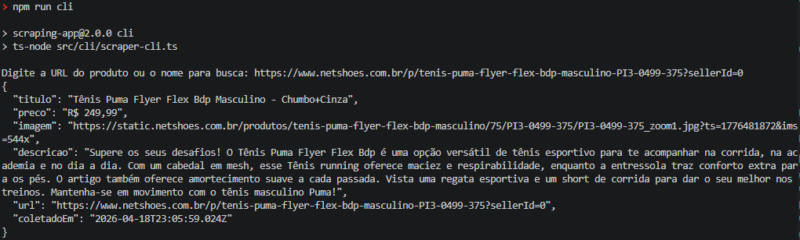
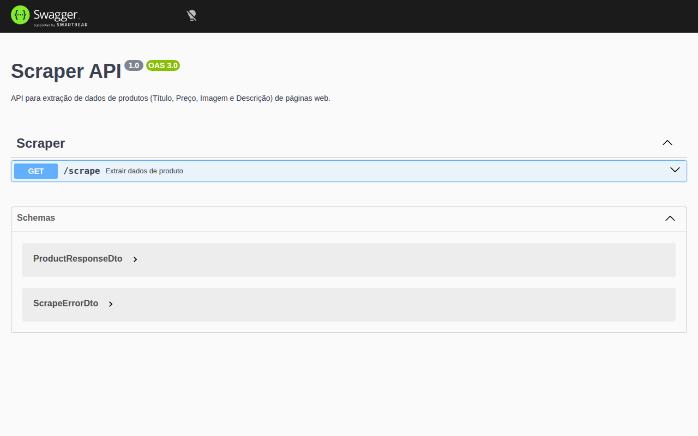
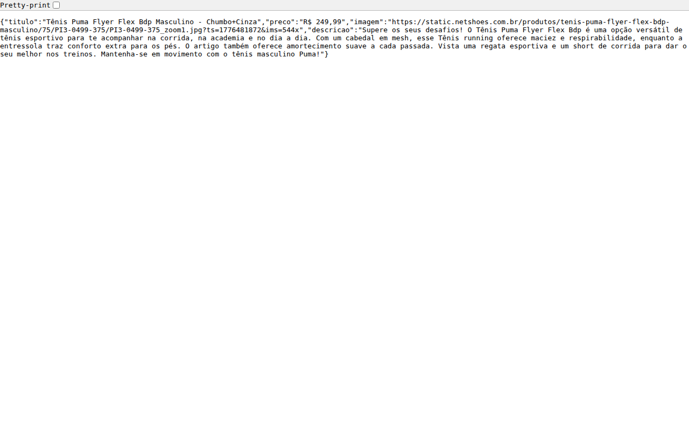
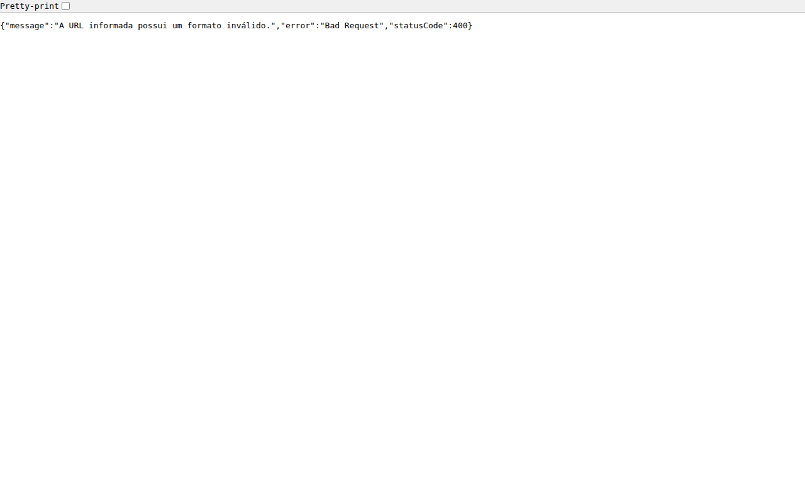

# Resultados e Evidências do Projeto - Scraper API

Este documento serve como prova de execução e validação dos requisitos solicitados para o Web Scraper.

## 1. Execução via CLI (Script Original)

Nesta seção, estão as evidências da execução do scraper através do terminal, utilizando o comando `node src/index.js`.

### Exemplo de Saída no Terminal
> Print do terminal mostrando a execução e a confirmação de extração.


---

## 2. Execução via API (NestJS + Swagger)

Evidências da API em funcionamento, demonstrando a integração com o NestJS e a documentação interativa.

### Interface Swagger UI
> Print da tela do Swagger (http://localhost:3000/api) com o título "Scraper API".


### Requisição com Sucesso (Status 200 OK)
> Print do teste feito no Swagger ou via Postman/Insomnia com uma URL da Netshoes.


### Validação de Erro (Status 400 Bad Request)
> Print demonstrando a validação de URL inválida ou ausente.


---

## 3. Dados Extraídos (resultado.json)

Abaixo, um exemplo da estrutura de dados salva no arquivo `resultado.json` após as execuções.

```json
[
  {
    "titulo": "Tênis Puma Flyer Flex Bdp Masculino - Chumbo+Cinza",
    "preco": "R$ 249,99",
    "imagem": "https://static.netshoes.com.br/produtos/tenis-puma-flyer-flex-bdp-masculino/75/PI3-0499-375/PI3-0499-375_zoom1.jpg",
    "descricao": "Supere os seus desafios! O Tênis Puma Flyer Flex Bdp é uma opção versátil de tênis esportivo...",
    "url": "https://www.netshoes.com.br/p/...",
    "coletadoEm": "2026-04-18T15:48:03.000Z"
  }
]
```

---

## 4. Considerações Técnicas Aplicadas

- **Resiliência**: Retry com backoff aplicado na `BasePage.js`.
- **Furtividade**: Rotação de User-Agents configurada no serviço.
- **Arquitetura**: Uso de Page Object Model (POM) para separação de responsabilidades.
- **Documentação**: JSDoc aplicado nos arquivos core e OpenAPI (Swagger) na camada de transporte.
